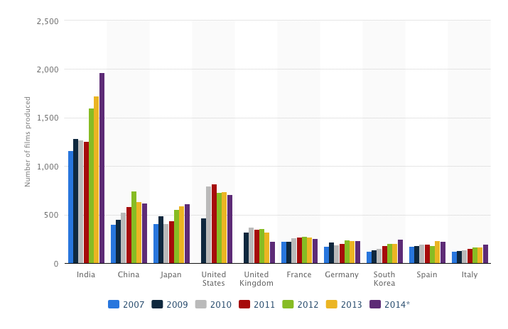
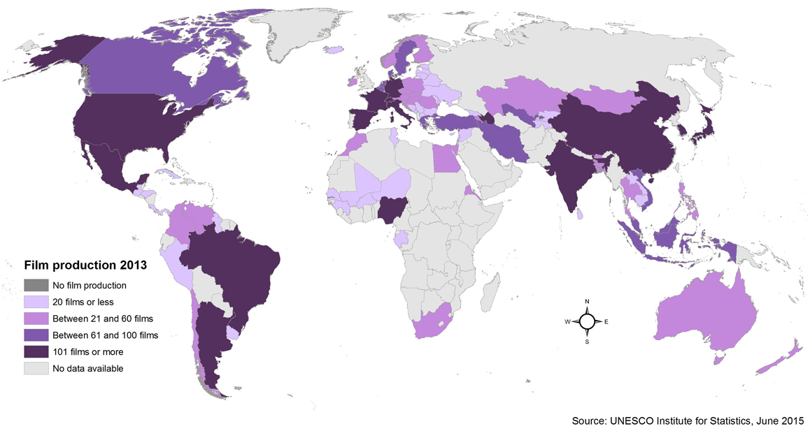
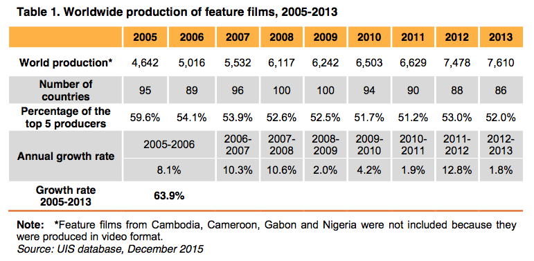
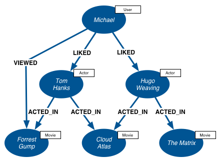

# CineJSON

 - Author: **Alex Coppen** (azcoppen@protonmail.com)

MovieJSON is an object notation interchange standard for storing and exchanging bibliographic information about films and TV programs.

## How Big Is The Problem?

Let's ask 3 simple questions: 

1. How many films are produced every year by each country?
2. How many films have been produced, ever, in total?
3. How many films were produced worldwide in 2016?

The answers are surprisingly difficult to find.

In *Entertainment Industry Economics: A Guide For Financial Analysis*, author Harold Vogel estimates there are **500,000** films in existence, and 3M TV/video clips. 

According to IMDB (http://www.imdb.com/stats), since 1874 there's been an average of **2,577 films produced each year around the world**. the site lists 4,211,243 titles, 7,825,277 people, and 84,285,456 credits. Of those, **369,499** are feature films, and 2,744,196 are TV episodes.

As an example according to ChartsBin, 6,324 movies were produced in 2009 (source: http://chartsbin.com/view/pu4). *Statistica* shows something different:



According to Wikipedia:

> Currently, the largest markets by box office are United States, China, United Kingdom, Japan, South Korea and India; and the countries with the largest number of film productions are India, Nigeria, and the United States. The worldwide theatrical market had a box office of US$38.3 billion in 2015. The top three continents/regions by box office gross were: Asia-Pacific with US$14.1 billion, North America with US$11.1 billion and Europe, the Middle East and North Africa with US$9.7 billion

For a global view, we have to turn to UNESCO's "Diversity" report, which combs data from the UIS Feature Film Statistics Survey: available at http://data.uis.unesco.org.



>"In 2012, 7,478 feature films were produced by a total of 88 countries. In 2013, this figure grew to 7,610 feature films produced by companies in 86 countries. There was a 13% growth in worldwide production, comparing production by 90 countries in 2011 to 88 countries in 2012. This significant rise in global film production – the highest year-to-year growth during the 2005-2013 period – was crowned by a growth of 1.8% in 2013. "



Source: http://www.uis.unesco.org/culture/Documents/ip29-diversity-film-data-2016-en.pdf

According to TheNumbers (http://www.the-numbers.com/movies/production-countries/), the top 5 producers are:

- United States (10,854	, avg. budget 38M, BO 466B)
- United Kingdom (1,523, avg. budget 30M, BO 38B)
- France (1,311, avg. budget 24M, BO 14B)
- Germany (535, avg. budget 32M, BO 7B)
- China (474, avg. budget 34M, BO 14B) 

This is obviously inaccurate, as any other data source shows India and Nigeria as leagues ahead of any other western country.

To summarise, the problem isn't actually of size, but rather of heterogeneity:

 - Any comprehensive film bibliography would contain around **400-500,000 records**.
 - Yearly growth is < 2%, so approximately **7,500 records** would be added each year.

To put that in perspective, the library of Congress has 130M records, with 10,000 added per *day*. YouTube has 65,000 videos added a day. Sprint processes 365M call records, Google 91M searches per day. Facebook's users have uploaded 250BN photos, at a rate of 350M per day.

So, the problem is comparatively small, even with IMDB's 85M credits.

*Or for the nerds, there are about 2^63 grains of sand on all of the beaches of the Earth, and/or 2^160 possible RIPE-MD160 Blockchain addresses (1,461,501,637,330,902,918,203,684,832,716,283,019,655,932,542,976 hashes).*

## Aside: Industry Horrors

A constant factor noted for 20+ years by Harold Vogel is that only 30% of films reach their audience, meaning **70% of films lose money** upon theatrical release.

Dr Ian MacDonald (2004) suggests that less than 2% of screenplays presented to producers become movies, meaning **98% of screenplays go unproduced**.

When combined, these issues form the *"Less-Than-One-Percent Problem"*:

**Problem (1)** – 98% of screenplays are not produced; and, of the 2% of screenplays selected for production, there emerges:

**Problem (2)** – Namely, that 70% of movies lose money;

Thus, resulting in:

**Problem (3)** – That **0.6%** (or, less than 1%) of screenplays presented to producers break even, as a movie.

Those are absolutely stunning numbers unparalleled in any other industry.

Source: *"TWENTY-FOUR OPEN PROBLEMS IN THE MOVIE SCREENWRITING DOMAIN"* by Joe T Velikovsky.


## Existing Bibliographic Sources
There are a dizzying array of different bibliographies available to any data hunter, the most well-known being Amazon-owned **IMDB**. Almost every bibliography is **completely different** (almost arbitrary), yet mostly *incomplete* from one perspective or another.

Examples include: 

### Classification/Review Libraries

- Amazon IMDB
- Rotten Tomatoes
- Metacritic
- TheMovieDB
- Wikipedia
- TCM
- Film Index
- BBFC/MPAA
- BMDB (Bangla)
- Baseline StudioSystems
- American Film Institute (AFI)
- British Film Insitute (BFI)

### Copyright

 - Writer's Guild
 - US Congress
 - US/CA/UK/AU Copyright Agencies

### Screenplays

- IMSDB
- Simply Scripts
- Script Lab
- The Screenplay DB

### Financial

- TheNumbers (OpusData)
- Box Office Mojo
- Nielsen Data
- Rentrak

### Production Materials

- IMCDB (Vehicles)
- IMFDB (Firearms)
- PropBay

### Locations
 
- movie-locations.com
- The Movie Map

### Audio

 - SoundNet
 - TuneFind
 - Soundtrack Collector
 - Discogs
 - MFDB
 - IMVDB (Music videos)

### Social

 - Facebook Pages

On top of this, TV and movie platforms such as *Netflix*, *iTunes*, *Google Play*, and *Amazon*, all have their own data libraries.

## Existing APIs

Despite the enormous litany of disparate sources, accessing comprehensive data on films and TV shows is incredibly problematic and inconsistent.

#### IMDB

IMDB provides a reasonably-sized dump of its data as raw text files ("interfaces"), accessible via FTP. These aren't amazingly helpful, as they require parsing.

**Official IMDB data dumps**
http://www.imdb.com/interfaces

```
wget ftp://ftp.funet.fi/pub/mirrors/ftp.imdb.com/pub/actresses.list.gz
wget ftp://ftp.funet.fi/pub/mirrors/ftp.imdb.com/pub/actors.list.gz
```

**Unofficial API (OMDB)**

http://www.omdbapi.com/

**Official JSON app API**

http://app.imdb.com/

**Official Web JS API** (JSONP)

- http://sg.media-imdb.com/suggests/a/aa.json
- http://sg.media-imdb.com/suggests/h/hello.json
- http://www.imdb.com/xml/find?json=1&nr=1&nm=on&q=jeniffer+garner
- http://www.imdb.com/xml/find?xml=1&nr=1&tt=on&q=lost

#### Others

- https://www.themoviedb.org/documentation/api
- http://www.filmcrave.com/api.php
- https://developer.fandango.com/Rotten_Tomatoes


## Structural Components

There are several key components that are identifiable in all produced televisual productions, and can be collated into logical groups:

- Awards
- Cast
- Characters
- Crew
- Classifications
- Description(s)
- Director
- Localization(s)
- Locations
- Ownership
- Performance
- Photographic Tools
- Producer(s)
- Promotional Materials
- Scenes
- Script
- Soundtrack
- Release(s)
- Writer(s)

## Distribution & Asset Management

Once a film has been produced and mastered, it is provided to multiple distributors in different countries for exhibition. In this process, the film or TV show is broken down into separable components, to aid in localization and/or environmental customization (e.g. sound).

#### Example Digital Cinema Package (DCP):

- Hi-resolution copy
- Hi-resolution copy (Apple Pro-Res 4444)
- Hi-resolution copy (H.264)
- Reels (same formats)
- LtRt / LoRo mix for each reel + full length version
- Music LtRt / LoRo mix for each reel + full length version
- SFX/Foley/production sound: fully loaded M&E LtRt / LoRo mix for each reel + full length version
- Dialogue LtRt / LoRo mix for each reel + full length version
- 5.1 mix full length version
- 5.1 music mix full length version
- 5.1 sfx/Foley/production sound: fully loaded M&E full length version.
- 5.1 dialogue mix full length version.
- 5.1 full mix for each reel
- 5.1 music mix for each reel
- 5.1 SFX/Foley/production M&E fully loaded mix for each reel
- 5.1 dialogue mix for each reel
- Behind-the-scenes material with audio file breakdowns
- Title cards for all of the behind-the-scenes materials
- CD of all music, fully documented
- Timecode data list of every word spoken in the film (for foreign dubbing)
- All timecode data for all reels
- Production/Shooting Script
- Poster and all graphic elements
- Chain of title / copyright
- Full credits list
- Trailer with all associated audio breakouts
- Min. 50 behind-the-scenes stills
- Min. 50 production stills
- DISK DRIVE and TAPE based versions of all video material

#### Example Legal Paperwork:

- Archival Clip Licenses
- Cast and Crew Restrictions
- Certificate of Authorship
- Certificate of Origin
- Chain of Title
- Credit Items
- E&O
- Literary Materials
- MPAA Documentation
- Music
- Other Agreements

## Graph Databases

If you've ever put together a movie database, you'll know that neither relational databases (e.g. SQL) nor NoSQL databases (e.g. Hadoop, Mongo) fit particularly well or efficiently with artistic endeavour. 

Being mass-collaboration projects with repetitive entities, film and TV are arguably more suited to *graph* databases.

> A graph database, also called a graph-oriented database, is a type of NoSQL database that uses graph theory to store, map and query relationships. 

> A graph database is essentially a collection of nodes and edges. Each node represents an entity (such as a person or business) and each edge represents a connection or relationship between two nodes. Every node in a graph database is defined by a unique identifier, a set of outgoing edges and/or incoming edges and a set of properties expressed as key/value pairs. Each edge is defined by a unique identifier, a starting-place and/or ending-place node and a set of properties."

<p align="center">



Example Cipher query to find the most prolific actors:

```cipher
MATCH (a:Actor)-[:ACTS_IN]->(m:Movie)
RETURN a, count(*)
ORDER BY count(*) DESC LIMIT 10;
```

References:

- https://neo4j.com/developer/movie-database/
- https://archive.ics.uci.edu/ml/datasets/Movie